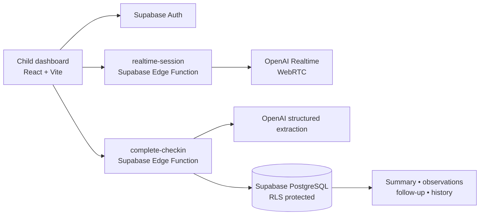

# Nila

### A little closer, even from miles away.

Nila is a multilingual AI voice companion that helps adult children stay connected to elderly parents living away from them. It turns a natural, respectful voice check-in into concise, grounded context that helps families have more meaningful human conversations.

> **AI handles the continuity. Humans handle the connection.**

## Why Nila

Distance often means missing the small things: a neighbour visit, a change in sleep, a plan for tomorrow, or something a parent wants to talk about. Nila provides a calm, private check-in space that helps families stay informed without pretending to replace a family relationship or a healthcare professional.

## What works today

- Secure child authentication with Supabase Auth
- Parent onboarding: name, phone number, relationship, preferred language, and timezone
- Browser-based AI voice check-ins using WebRTC
- Natural English and Malayalam conversation support
- Explicit AI identity and grounded, safety-oriented conversation guidance
- End Check-in flow with safe session finalization
- AI-generated summary, highlights, observations, follow-up items, and historical context
- Atomic persistence of completed check-ins in Supabase
- A responsive family dashboard with empty, loading, and error states
- Row Level Security: each child can access only their own profile, linked parents, and associated check-in data

## Demo flow

1. Create an account or sign in.
2. Add a parent and choose their preferred language.
3. Open **Voice check-in** and select that parent.
4. Start a natural conversation in English or Malayalam.
5. Choose **End Check-in** and wait for the completion screen.
6. Open the dashboard to review the saved summary, What You Missed, follow-up items, recent check-ins, and any supported historical context.

Only completed conversations are summarized. Nila never creates a summary for an interrupted or empty check-in.

## Demo materials

[Open the Nila hackathon demo folder on Google Drive](https://drive.google.com/drive/folders/15aSrGRFm19oGgyOBv2Q34kMRzYGcA3LN?usp=sharing)

## Product principles

- **Grounded:** summaries, observations, and follow-ups originate only from what was actually shared.
- **Human-centered:** Nila supports connection; it does not pretend to be a family member.
- **Safety-aware:** Nila does not diagnose, prescribe medication, or invent medical information.
- **Private by design:** API keys remain server-side, and Supabase RLS scopes family data to authenticated relationships.

## Architecture



### Data flow

```text
Voice conversation
  → final session close
  → grounded extraction
  → atomic persistence
  → dashboard context
  → better human follow-up
```

## Technology

| Layer | Technology |
| --- | --- |
| Frontend | React, Vite, TypeScript, Tailwind CSS |
| Authentication and database | Supabase Auth, PostgreSQL, Row Level Security |
| Server workflows | Supabase Edge Functions |
| Live voice | OpenAI Realtime over WebRTC |
| Post-check-in intelligence | OpenAI Responses API with structured output |
| Icons and UI primitives | Lucide React, Radix Slot, CVA |

## Local setup

### 1. Install dependencies

```bash
npm install
```

### 2. Configure public Supabase values

Copy `.env.example` to `.env.local`, then add only the public values from your Supabase project’s **Connect** dialog:

```bash
VITE_SUPABASE_URL=
VITE_SUPABASE_PUBLISHABLE_KEY=
```

Never add a Supabase service-role key, OpenAI API key, Twilio credential, or database password to frontend environment variables.

### 3. Configure server-side secrets

Set the following only in Supabase Edge Function secrets:

```text
OPENAI_API_KEY
```

The optional phone-call prototype additionally requires server-side Twilio secrets. It is not needed for the browser Voice Check-in demo.

### 4. Apply database migrations

Apply the SQL migrations in `supabase/migrations/` to the intended Supabase project, in filename order. The browser check-in completion path requires the post-check-in migrations, including `persist_completed_checkin`.

### 5. Deploy required Edge Functions

```bash
npx supabase functions deploy realtime-session --project-ref YOUR_PROJECT_REF
npx supabase functions deploy complete-checkin --project-ref YOUR_PROJECT_REF
```

### 6. Run Nila

```bash
npm run dev
```

Open the local URL printed by Vite.

## Verification

```bash
npm run build
git diff --check
```

## Project structure

```text
src/
  components/       Reusable UI and dashboard components
  lib/              Supabase, voice transport, and application data helpers
  pages/            Landing, authentication, dashboard, and voice check-in screens
  providers/        Authentication state
  routes/           Route protection
supabase/
  functions/        Server-side Realtime and check-in completion workflows
  migrations/       PostgreSQL schema, RLS, and atomic persistence migrations
```

## Known demo boundary

The browser Voice Check-in is the supported live demo path. Phone calling depends on a separately provisioned, voice-capable telephony sender and is intentionally not required for the browser demo.

## Screenshots

Add screenshots only after a completed, real check-in is available. Do not use empty, failed, or fabricated dashboard records as product evidence.

Recommended captures:

1. Parent overview with **Start AI check-in**
2. Active Voice Check-in conversation
3. Completed dashboard with real summary and observations

## License

MIT. See [LICENSE](LICENSE).
