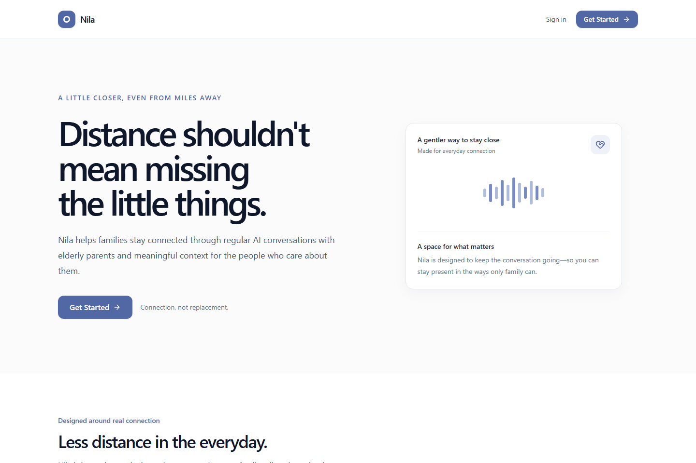
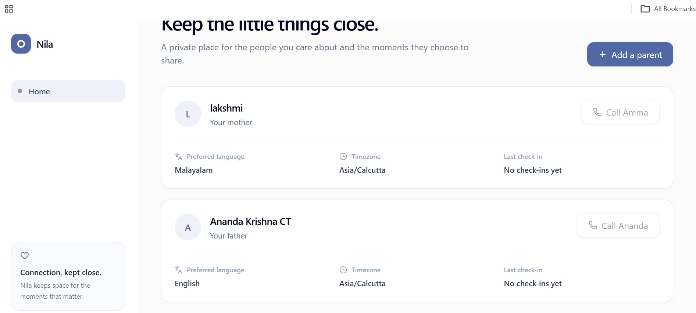
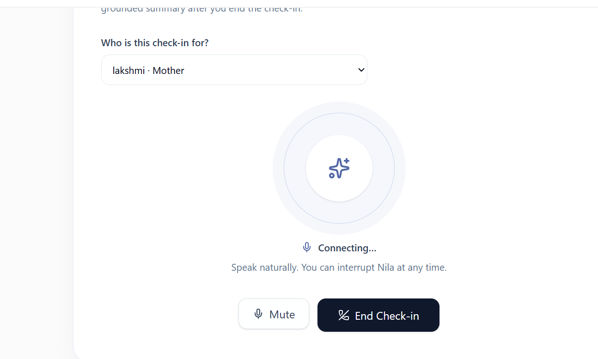

# Nila

### A little closer, even from miles away.

## Overview

Nila is a multilingual AI voice companion for families living apart. It gives elderly parents a calm space for a natural browser-based voice check-in, then turns only a completed conversation into concise, grounded context for the people who care about them.

> **AI handles the continuity. Humans handle the connection.**

## Problem Statement

When adult children live away from their parents, it is easy to miss the everyday details that make a relationship feel close: a plan for tomorrow, a neighbour visit, a difficult night of sleep, or something a parent wants to talk about. Families need gentle continuity between calls—not surveillance, diagnoses, or a replacement for human connection.

## Solution

Nila lets a family member add a parent, select a preferred language, and begin a natural AI voice check-in in the browser. When the conversation ends normally, Nila creates a grounded summary, highlights, observations, follow-up items, and historical context. The child sees this context in a private dashboard and can use it to have a warmer, more meaningful personal conversation.

## Features

- Secure sign-up, login, logout, protected routes, and persistent Supabase authentication
- Parent onboarding with relationship, preferred language, phone number, and timezone
- Natural browser-based AI Voice Check-ins with English and Malayalam support
- Safe End Check-in flow with reliable WebRTC session finalization
- Grounded summary, highlights, observations, follow-up items, and historical context after completed check-ins
- Responsive family dashboard with loading, empty, and error states
- Atomic Supabase persistence and Row Level Security for family data

## Tech Stack

- **Frontend:** React, Vite, TypeScript, Tailwind CSS, React Router
- **Backend:** Supabase Edge Functions (Deno)
- **Database:** Supabase PostgreSQL with Row Level Security
- **APIs / Services:** Supabase Auth, OpenAI Realtime API over WebRTC, OpenAI structured extraction workflow
- **Hosting / Deployment:** Vercel, Supabase
- **Other Tools:** shadcn/ui-style primitives, Radix Slot, Lucide React, Class Variance Authority

## Codex / OpenAI Usage

Codex and ChatGPT were used throughout the hackathon to accelerate ideation, architecture planning, UI/UX refinement, implementation, debugging, testing, and documentation.

OpenAI is also part of the product itself: Nila uses the Realtime API for natural browser voice conversations and a server-side OpenAI workflow to produce structured post-check-in context. API keys remain server-side. The dashboard does not fabricate records: summaries and observations are saved only after a completed check-in.

## Demo

### Live Demo

[Nila on Vercel](https://nila-ai.vercel.app)

> The current Vercel deployment is paused and must be resumed by the project owner before the public URL can be used. The local demo flow below remains the reliable presentation path.

### Demo / Pitch Video

[Open the Nila hackathon demo materials on Google Drive](https://drive.google.com/drive/folders/15aSrGRFm19oGgyOBv2Q34kMRzYGcA3LN?usp=sharing)

For a live presentation:

1. Create an account or sign in.
2. Add a parent and select their preferred language.
3. Open **Voice Check-in** and select that parent.
4. Hold a natural conversation in English or Malayalam.
5. Select **End Check-in** and wait for completion.
6. Return to the dashboard to review the saved summary, What You Missed, follow-up items, and historical context.

## Screenshots

### Landing page



### Parent overview



### Voice Check-in



## How to Run Locally

```bash
git clone https://github.com/Anandakrishnna/Nila_AI.git
cd Nila_AI
npm install
npm run dev
```

Before starting the app, create `.env.local` from `.env.example` and add only public Supabase configuration:

```bash
VITE_SUPABASE_URL=
VITE_SUPABASE_PUBLISHABLE_KEY=
# Or, for legacy Supabase projects:
# VITE_SUPABASE_ANON_KEY=
```

Never expose a Supabase service-role key, OpenAI API key, Twilio credential, or database password in frontend variables. The browser Voice Check-in also requires an `OPENAI_API_KEY` configured as a Supabase Edge Function secret, the supplied database migrations, and the `realtime-session` and `complete-checkin` functions deployed to the intended Supabase project.

```bash
npx supabase functions deploy realtime-session --project-ref YOUR_PROJECT_REF
npx supabase functions deploy complete-checkin --project-ref YOUR_PROJECT_REF
npm run build
```

## Additional Notes

- Nila is designed to support human connection, not replace family or healthcare professionals. It never diagnoses, prescribes medication, or invents observations.
- Only completed conversations are summarized; interrupted or empty sessions do not produce a fake summary.
- The supported demo path is browser Voice Check-in. Phone calling is an optional future extension that requires a separately provisioned, voice-capable telephony sender.
- Data is scoped to authenticated family relationships through Supabase Row Level Security.

## License

MIT. See [LICENSE](LICENSE).
